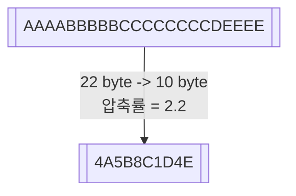

# 파일 압축
> **데이터 압축이 필요한 이유?**  
> 대용량 데이터는 전송 속도가 느리고 전송 중 문제가 발생할 가능성이 높기 때문

## 압축의 종류
| 모드 | 설명 |
|:-----------:|:-----------:|
| <b>무손실 압축</b> | 데이터 손실이 전혀 없는 압축 |
| <b>손실 압축</b> | 사람이 눈치채지 못 할 수준의 정보는 버리고 압축 이미지, 영상 파일 등의 용량을 줄이면서 내용물을 보는 것엔 지장 X |

## 압축률
**`원시 자료양(데이터 원본 크기) / 압축된 자료량(압축된 데이터 크기)`**  
다양한 압축 알고리즘에 따라 압축 성능 및 시간이 달라짐
### e.g. 런-길이 부호화 Run-Length Encoding
대표적인 무손실 압출 방법

## 압축
인코딩 encoding

## 압축 해제
디코딩 decoding